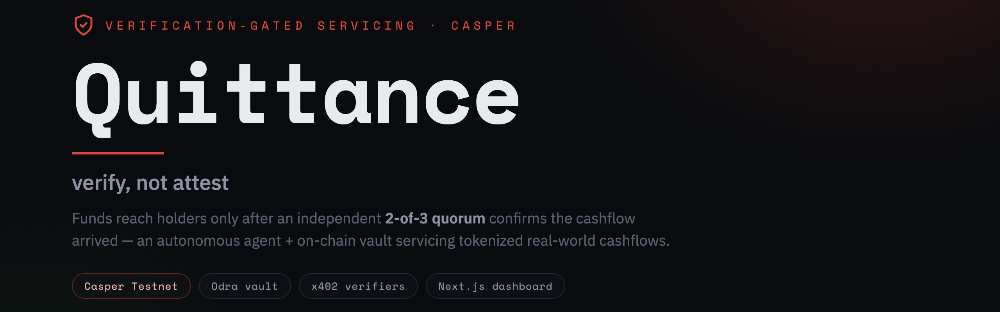

<p align="center">
  
</p>

<p align="center">
  <a href="https://quittance.rectorspace.com"></a>
  <a href="https://quittance.rectorspace.com/demo"></a>
  
  
  
</p>

<p align="center">
  <b>Autonomous, verification-gated servicing for tokenized real-world cashflows on Casper.</b><br>
  An autonomous agent and on-chain vault that release a tokenized cashflow to its holders
  <i>only after independently verifying the money actually arrived</i> — <b>verification, not attestation</b>.<br>
  The contract verifies the quorum <b>on-chain</b>; verifiers carry <b>on-chain reputation</b>; the AI explains — the chain decides.
</p>

<p align="center">
  Built for the <a href="https://dorahacks.io/hackathon/casper-agentic-buildathon">Casper Agentic Buildathon 2026</a> · Casper Innovation Track.
</p>

---

## Contents

- [The problem](#the-problem)
- [The insight](#the-insight-verify-not-attest)
- [How it works](#how-it-works)
- [The demonstrable moment](#the-demonstrable-moment)
- [The depth ladder](#the-depth-ladder--where-the-quorum-is-enforced)
- [The moat stack](#the-moat-stack)
- [x402 — native, not bolted on](#x402--native-not-bolted-on)
- [Casper example-direction-#2](#casper-example-direction-2)
- [Proven on-chain](#proven-on-chain-casper-test)
- [See it live](#see-it-live)
- [Architecture](#architecture)
- [Repository layout](#repository-layout)
- [Run it locally](#run-it-locally)
- [Honesty & disclosure](#honesty--disclosure)
- [License](#license)

---

## The problem

Tokenized real-world assets — invoices, rent, royalties, private credit — are a fast-growing on-chain market. But **servicing** them is still manual and trust-based: someone has to confirm the off-chain cashflow genuinely arrived, then distribute it to token holders. On-chain today, projects push data *in* via oracles; nobody autonomously pushes **verified cashflow out**. Holders are left trusting an issuer's word that they got paid.

> Recording that a payout happened is not proof it was *owed*.

## The insight: verify, not attest

Quittance shifts servicing from **attestation** (one source's say-so) to **verification** (an independent **2-of-3 quorum**) *before any funds move*. The agent doesn't take anyone's word — it pays independent verifiers to check, and gates the on-chain distribution on their quorum.

## How it works

Each cycle, the autonomous servicer agent:

1. **Detects** a cycle is due for a tokenized asset.
2. **Pays three independent verifiers over [x402](https://x402.org)** to answer: *"did the cashflow arrive?"* — real, per-call economic commitment, settled on Casper.
3. **Requires a 2-of-3 quorum** of signed yes/no verdicts.
4. **If met** → calls the vault's `distribute()`, which **verifies each Ed25519 verdict signature on-chain** (SPEC-4), pays holders pro-rata, writes a verifiable **receipt** (SPEC-1), scores each verifier's **on-chain reputation** (SPEC-6), and the agent records an **AI verification brief** (SPEC-5) explaining the cycle.
5. **If not** → **halts, pays out nothing, flags a dispute** — and writes no receipt, scores no reputation, records no brief.

```
detect cycle → pay 3 verifiers (x402) → 2-of-3 quorum?
                                          ├─ yes → distribute on-chain + receipt
                                          └─ no  → HALT · funds withheld
```

## The demonstrable moment

Feed a fake *"paid"* claim through one compromised verifier and watch the agent **refuse to release the funds**. That refusal — paid-for, independent, and enforced on-chain — is the whole product. **[Try it interactively →](https://quittance.rectorspace.com/demo)**

## The depth ladder — where the quorum is *enforced*

| Level | Quorum enforced… | Who's here |
| --- | --- | --- |
| **L0** *(qualifier)* | off-chain (agent counts 2-of-3) | Quittance (shipped) |
| **L1** | off-chain; chain logs proof | AgentPay Guard (code-verified) |
| **L2.5** | on-chain address-collation (counts callers) | Concordia (code-verified) |
| **🔥 L3** *(final-round)* | **ON-CHAIN signature verification of data-bound verdicts (atomic)** | **Quittance (SPEC-4)** |
| **L4** | L3 + verdicts bound to `(asset, cycle)` + replay protection | Quittance (SPEC-4) |

The qualifier shipped at L0. The final-round campaign moves the quorum **on-chain** (SPEC-4): `distribute()` verifies each Ed25519 signature via `env().verify_signature`, counts valid distinct-verifier yes-votes, and reverts `QuorumNotMet` below threshold. The servicer key alone can no longer release funds — it must present ≥quorum valid signed yes-verdicts. **This is the strongest on-chain verification in the finalist field** (code-verified vs demo-simple competitors; Caspergard's repo 404 — unverifiable).

## The moat stack

| SPEC | What it adds | Honest limit |
| --- | --- | --- |
| **SPEC-4** | On-chain Ed25519 signature verification (L3) — forged/replayed/unregistered sigs rejected by the chain | single-operator verifiers (demo) |
| **SPEC-6** | On-chain per-verifier reputation (`cycles_seen`/`voted`/`agreed`) — the unique moat; maps to Casper example-#2 | tracks **settled** cycles only — halted cycles don't score (no ground truth without settlement) |
| **SPEC-1** | Queryable on-chain `Receipt` per `(asset, cycle)` via `get_receipt` | new cycles only (no backfill) |
| **SPEC-5** | Per-cycle AI verification brief — the agent explains the verified record on-chain | **narration, not proof** — the verifiable truth is the on-chain sigs + reputation |

**The property that makes the moat honest:** the only way to accumulate `cycles_agreed` is to vote `yes` on a cycle that **actually settles**. A compromised verifier cannot inflate its reputation via a fraud cycle — the cycle halts, no update, no reward.

## x402 — native, not bolted on

**67% of the Casper Agentic Buildathon prize pool is x402 Ecosystem Credits.** Quittance uses x402 **natively** for every verifier payment — real, per-call economic commitment, settled on Casper via the CSPR.cloud facilitator. Each of the three verifiers is paid per verdict over x402 (header `PAYMENT-SIGNATURE`); the settle txs are in the table below. This isn't a side feature — it's the payment rail the whole verification thesis runs on.

## Casper example-direction-#2

Casper's example-direction-#2: *"RWA Oracle Agents with Verifiable On-Chain Identity and a reputation score based on historical accuracy."* **Quittance is that, built:**

- ✅ **Verifiable on-chain identity** — verifiers are registered pubkeys in the vault's `verifier_registry` from `register_asset` (SPEC-6).
- ✅ **Reputation score based on historical accuracy** — `cycles_agreed` / `cycles_voted` per verifier, queryable via `get_verifier_registry` (SPEC-6).
- ✅ **RWA oracle agents** — the autonomous servicer + three x402-paid verifiers for tokenized cashflow servicing (the RWA lane, uncontested in the field).

## Proven on-chain (casper-test)

Both paths are real, executed, and verifiable on [`testnet.cspr.live`](https://testnet.cspr.live). The agent uses the **same vault and the same three verifiers** for both cycles — *only the consensus differs.*

| Event | Path | Result | Transaction |
| --- | --- | --- | --- |
| `ServicerVault` deployed | — | entity `6a6747d2…b27e132` | [`4313f749…1c4c9e`](https://testnet.cspr.live/deploy/4313f7499d17804a74b38ef9503d18bfd4cbff415606cde5e9fe6e04ef1c4c9e) |
| Qualifying x402 settle | — | first verifier payment | [`6b03ad75…bf3cd4`](https://testnet.cspr.live/deploy/6b03ad751ff6c044e3ff2cbfea47d628643e3b58dabdf6d087a4cc5609bf3cd4) |
| **Distribute** | ✅ **Happy** — 3/3 → quorum met | **Holder A +7 / Holder B +3 CSPR** (pro-rata) | [`6821e0f3…c37829`](https://testnet.cspr.live/deploy/6821e0f3e6b01325965562f964047782dab13d4602b7dae7bc7e67c70ac37829) |
| Verifier settle · v1 | 🛑 **Fraud** — 1/3 → quorum NOT met | agent paid, **then halted** | [`a02b1c7d…d6a7d`](https://testnet.cspr.live/deploy/a02b1c7d2ed52ea82ff68740d9b5a65d9716cee8594b482a13d0c27e846d6a7d) |
| Verifier settle · v2 | 🛑 Fraud | agent paid, then halted | [`40a85e53…75df93`](https://testnet.cspr.live/deploy/40a85e53df987e9af3b3e2261833419de84676245332c5fa8570354b8875df93) |
| Verifier settle · v3 | 🛑 Fraud | agent paid, then halted | [`8a962e50…4115ff`](https://testnet.cspr.live/deploy/8a962e502601c27db98a8195ef6c790f18df25f32c56b40306c02d8f5b4115ff) |

**The result that matters:** in the fraud cycle one verifier lies *"yes"* while the two honest ones say *"no."* The agent still pays all three for verification (real money, on-chain) — and **still refuses to release the cashflow on a single dishonest "yes."** Holder balances stay unchanged; the agent's own funds never move into a distribution. **You cannot bribe one verifier to unlock the money.**

## See it live

| | |
| --- | --- |
| 🟢 **Live dashboard** | **[quittance.rectorspace.com](https://quittance.rectorspace.com)** — issuer view (asset + both cycle histories) |
| 👛 **Holder view** | [quittance.rectorspace.com/holder](https://quittance.rectorspace.com/holder) — balances read **live from chain** (7 / 3 CSPR, unchanged) |
| 🎬 **Demo video** | [quittance.rectorspace.com/demo](https://quittance.rectorspace.com/demo) (~2 min) |

## Architecture

| Component | Responsibility | Stack |
| --- | --- | --- |
| **`ServicerVault`** | Holds the native-CSPR distribution pool + holder registry; **verifies each Ed25519 verdict signature on-chain** (SPEC-4); records per-cycle **receipts** (SPEC-1) + per-verifier **reputation** (SPEC-6) + **AI briefs** (SPEC-5); exposes quorum-gated `distribute()`. | **Odra** (Rust), Casper |
| **Servicer agent** | Runs the cycle: pays verifiers over x402, enforces the quorum, calls the contract through stable adapter seams, verifies finality. | TypeScript, `casper-js-sdk` v5 |
| **Verifier services ×3** | Independent, **x402-gated** HTTP endpoints returning *signed* yes/no verdicts over evidence. | TypeScript / Express |
| **Dashboard** | Issuer config + holder view: cycle history, quorum stamps, live on-chain balances, every tx deep-linked to cspr.live. | Next.js 15, Vercel |

**Casper-native by design:** an Odra contract on casper-test, a native-CSPR pool with pro-rata transfers, x402 verifier payments settled via the CSPR.cloud facilitator, real Ed25519 Casper identities, and holder balances read live from chain.

## Repository layout

```
quittance/
├── agent/          # autonomous servicer agent — runCycle state machine
├── packages/
│   ├── core/       # domain logic: verdict verification, quorum rules (framework-free)
│   └── adapters/   # chain + verifier client adapters (casper-js-sdk, x402)
├── contracts/      # ServicerVault — Odra (Rust) smart contract + wasm
├── verifiers/      # x402-gated verifier services (independent yes/no signers)
├── dashboard/      # Next.js dashboard (issuer + holder views), deployed on Vercel
├── e2e/            # end-to-end harness: deploy, fund, run-cycle, settle, check-balances
├── SPEC.md         # design
├── PLAN.md         # implementation plan
└── DAY1-DERISK.md  # critical-path de-risk runbook
```

## Run it locally

Prerequisites: **Node ≥ 18**, **pnpm**, and (for the contract) the **Rust toolchain + [cargo-odra](https://odra.dev)**.

```bash
pnpm install                                   # install the workspace
pnpm --filter @quittance/core test             # domain logic (verdict + quorum)
pnpm --filter @quittance/dashboard dev          # dashboard at http://localhost:3000
pnpm --filter @quittance/dashboard test         # dashboard unit tests
```

Contract build & tests:

```bash
cd contracts && cargo odra test                # OdraVM unit tests
```

End-to-end on casper-test (needs a funded testnet key — see `.env.example`):

```bash
node e2e/deploy-servicer.mjs submit            # deploy the vault
node e2e/harness/run-cycle.mjs happy           # quorum met  → distribute
node e2e/harness/run-cycle.mjs fraud           # quorum fails → halt
```

## Honesty & disclosure

For the buildathon demo, the off-chain *"cashflow arrived"* evidence is **mocked/sandboxed** — the three verifiers stand in for real payment-rail adapters (bank APIs, Stripe, etc.). The innovation is the **verification-gated autonomous release**, not the data source. **Testnet only**: verifier payments use WCSPR via x402, holder distribution is native test CSPR; the payout token is a test asset, not a real stablecoin.

Three honest limits of the final-round campaign, disclosed plainly:
- **Reputation tracks settled cycles only.** A halted cycle (the fraud showcase) reverts before any state write, so it scores nothing — the contract cannot authoritatively establish ground truth without settlement. The clean side: a compromised verifier **cannot inflate its reputation** via a fraud cycle (the cycle halts, no update).
- **The AI brief is narration, not proof.** The LLM explains the cryptographically verified record; it never decides fund release (the quorum stays signature-based). A compromised agent could mislead a dashboard reader, but cannot move funds — the on-chain signatures + reputation remain the verifiable truth.
- **Single-operator verifiers.** All three run by one operator (RECTOR) for the demo. SPEC-4 (distinct keys) + SPEC-6 (transparent reputation) make collusion *harder* and *visible*, not operationally impossible. Genuine verifier independence + a staking/slashing marketplace are post-hackathon (see [`ROADMAP.md`](./ROADMAP.md)).

## License

[MIT](./LICENSE) — © RECTOR-LABS.

<p align="center"><sub>Quittance · casper-test · <b>verify, not attest</b></sub></p>
